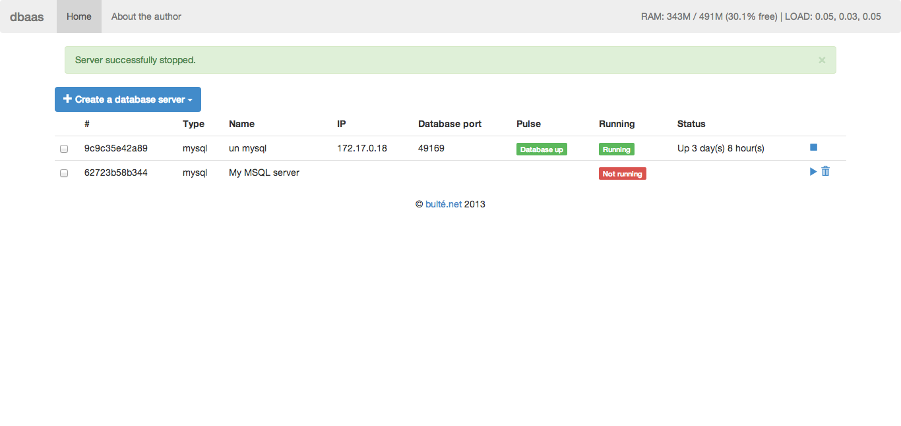

# Docker Databases As A Service

### Current stage: Alpha

## Purpose & features

* Deploy and monitor MySQL and MongoDB (soon) databases on [Docker](http://www.docker.io)
* Command line tool
* Web UI
* Pluggable database type (write your own adapter)

## Install

	$ git clone https://github.com/abulte/docker-dbaas.git
	$ cd docker-dbaas

	# create virtual env
	$ virtualenv pyenv
	$ . pyenv/bin/activate

	# install requirements
	$ pip install -r requirements.txt -r requirements-opt.txt

	# run web server
	$ python webapp.py

	# or use command line
	$ python dbaas.py <command>

## Use

TODO

## Depends and uses

* [Flask](http://flask.pocoo.org)
* [Flask-Script](http://flask-script.readthedocs.org/en/latest/)
* [Docker](http://www.docker.io)

## TODO

* MongoDB support
* Implement "port mapping?" option
* See about the circular imports ugly mess (Flask Plugin/Extension?)
* Automatic tests